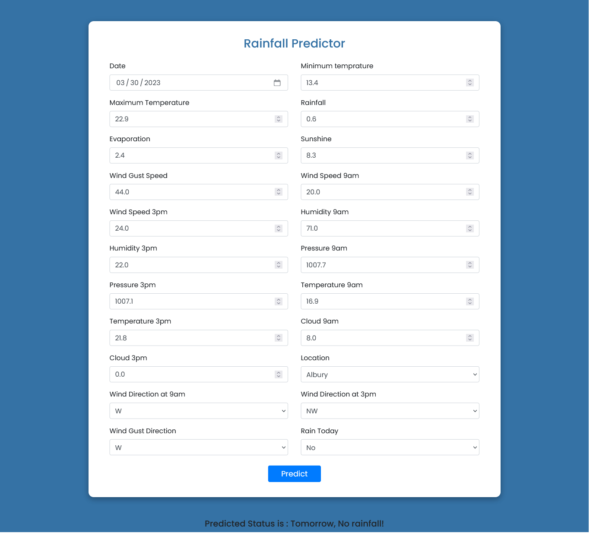

# Rainfy


Rainfy app used to predict whether it will rain the next day or not based on certain input parameters created using python's scikit-learn, fastapi, numpy and joblib packages.

## Dataset Description

This dataset contains about 10 years of daily weather observations from numerous Australian weather stations.

RainTomorrow is the target variable to predict. It means -- did it rain the next day, Yes or No?
This column is Yes if the rain for that day was 1mm or more.

The data contains the following columns:

| Feature Name  | Feature Description                        |
| ------------- | ------------------------------------------ |
| date          | Date of observation                        |
| mintemp       | Minimum temperature in Celsius             |
| maxtemp       | Maximum temperature in Celsius             |
| rainfall      | Amount of rainfall in mm                   |
| evaporation   | Amount of evaporation in mm                |
| sunshine      | Number of hours of sunshine                |
| windgustdir   | Direction of the strongest gust in degrees |
| windgustspeed | Speed of the strongest gust in km/h        |
| winddir9am    | Direction of the wind at 9am in degrees    |
| winddir3pm    | Direction of the wind at 3pm in degrees    |
| windspeed9am  | Speed of the wind at 9am in km/h           |
| windspeed3pm  | Speed of the wind at 3pm in km/h           |
| humidity9am   | Relative humidity at 9am in percent        |
| humidity3pm   | Relative humidity at 3pm in percent        |
| pressure9am   | Atmospheric pressure at 9am in hPa         |
| pressure3pm   | Atmospheric pressure at 3pm in hPa         |
| cloud9am      | Fraction of sky obscured by cloud at 9am   |
| cloud3pm      | Fraction of sky obscured by cloud at 3pm   |
| temp9am       | Temperature in Celsius at 9am              |
| temp3pm       | Temperature in Celsius at 3am              |
| raintoday     | Amount of rainfall today in mm             |
| location      | Location id number                         |

## Installation

Open Anaconda prompt and create new environment

```
conda create -n your_env_name python = (any_version_number > 3.10.8)
```

Then Activate the newly created environment

```
conda activate your_env_name
```

Clone the repository using `git`

```
git clone https://github.com/Prakashdeveloper03/Rainfy.git
```

Change to the cloned directory

```
cd <directory_name>
```

To install all requirement packages for the app

```
pip install -r requirements.txt
```

Then, Run the app

```
uvicorn main:app
```

## 📷 Screenshots

### Home Section


### About Section


### Developer Section


### Swagger UI


### Redoc UI


### Predictor Page


